# Continuous Monitoring and DevOps on AWS

### Course outline
1. Continuous Monitoring using Prometheus & Grafana
2. Prometheus Security and Use Cases
3. Continuous Monitoring using Nagios XI
4. Log Server 2.0 and alerting in Nagios
5. SDLC automation using AWS
6. Automating Infrastructure using CloudFormation
7. Application Deployment using Elastic Beanstalk
8. Application Deployment and Orchestration using ECS, ECR & EKS


### Objectives
- Understand Continuous Monitoring in DevOps
- Identify the different Continuous Monitoring Tools in DevOps
- Monitor your environment using Prometheus
- Visualize Prometheus Data using Grafana Dashboards
- Create a Monitoring system for your DevOps Pipeline


## Introduction to Continuous Monitoring
### Continuous Monitoring
It is an automated process by which one can observe and detect compliance issues and security threats during each phase of the DevOps pipeline

### Why use Continuous Monitoring?
- Assist with Healthy Business Performance
- Minimizes System Downtime
- Facilitates Rapid Responses
- Better Netwokr Visibility & Transparency

### Continuous Monitoring Tools in DevOps
- Monitoring tools
  - Sensu
  - Nagios
  - Prometheus
- Alerting tools
  - PagerDuty
  - ServiceNow
  - Slack
- Metric storage
  - Splunk
  - AWS
  - influxdb
- Visualization tools
  - Grafana


## Prometheus
- It is a community-driven open-source monitoring framework
- Has a robust alert mechanism
- A Cloud Native Computing Foundation (CNCF) graduated project
- Open source systems monitoring and alerting toolkit
- Collects and stores metrics as a time series data
- Scrapes targets
- PromQL is the language used to query time series in Prometheus
- Service discovery helps find our services and monitor them
- Exporters help to monitor 3rd party components
- Can send alerts to alert manager
- Prometheus runs on port 9090 and alert manager on 9093


### Prometheus architecture
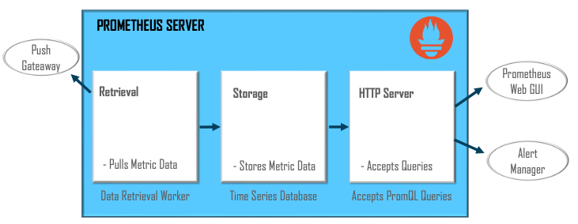


### Prometheus Features
- **Dimensional Data**

    Uses a dimensional data model where series are identified by a metric name and a set of key-value pair.

- **Simple Operations**

    Servers running Prometheus are independent of each other for reliability. Since it is written in Go language, the binaries can easily be updated.

- **Alert System**

    All the alerts are managed by an alert manager. The alerts are defined using the Prometheus's own PromQL

- **Visualization**

    Offers various options to visualize the monitoring data. The build-in expression browser can be integrated with tools such as Grafana. 

- **Library Support**

    With support of over ten different languages, creating and implementing custom libraries is very easy

- **Efficient Storage**

    Prometheus stores all the monitoring data on the local disk itself in an efficient custom format


### Prometheus on Kubernetes
- Constantly tracks the Kubernetes API for changes and updates the configuration accordingly
- Uses Custom Resource Definition called ServiceMonitor in order to monitor a target
- ServiceMonitor attaches itself to the target(s) using the matchLabel selector
- Works in a pull-based mechanism enabling abstraction from service being monitored

### Prometheus Metrics and its types

- **Counter**
  - Record a value that only goes up
  - Query how fast the value is increasing
- **Gauges**
  - Record a value that only goes up and down
  - You do not have to Query its rate
- **Histogram**
  - Tame many measures of a value to later calculate averages or percentiles
  - You know what the range of values will be up front, so you can define your own
- **Summary**
  - Take many measurements of a value, to later calculate average or percentiles
  - You don't know what the range of values will be up front, so cannot use histograms


<br><br>

## Grafana
Grafana is a multi-platform open-source analytics and interactive visualization web application. It provides:
  - Charts
  - Graphs
  - Alerts

### Grafana features
- **Visualize**

    Grafana has a plethora of visualization options to help you understand your data, beautifully

- **Alert**

    Seamlessly define alerts where it makes sense - while you're in the data

- **Unify**

    Grafana supports dozens of databases, natively. Mix them together in the same Dashboard

- **Alert**
    Grafana is completely open-source and backed by a vibrant community

- **Extend**

    Discover hundreds of dashboards and plugins in the official library

- **Collaborate**

    Bring everyone together, and share data and dashboards across teams


<br><br>

## Nagios XI

### Links
- Download link for Nagios<br>https://www.nagios.org/download/
- Download link for Nagios Plugins Project<br>https://github.com/nagios-plugins/nagios-plugins

#### Topics
- Introduction to Nagios XI
- Nagios Architecture
- Setting up and Configuring Nagios XI
- Managing Nagios XI
- Monitoring using Nagios XI

### Introduction to Nagios XI

Nagios XI is a enterprise Server and Network Monitoring Software

Nagios XI monitors all mission-critical components in the IT infrastructure
- Servers
- Networks
- Operating Systems
- Applications
- System Metrics
- Services
- Network Protocols

<br>

Nagios is a well-known open-source solution for continuous monitoring of Linux, Windows, applications and infrastructure workloads

Nagios depends on expert partners around the world to deploy services and support companies using their technology

<br>

Nagios XI helps every IT company in:
- IT Infrastructure Monitoring
- Multi-Tenant Capabilities
- Server Performance Monitoring
- Configuration Wizards
- Advanced User Management
- Extendable Architecture
- Customizability
- IT Operations Network
- Capacity Planning
- Network Incident Alerts
- Capacity Planning Graphs
- User-Specific Views
- Update Web Interface
- Infrastructure Management
- Configuration Snapshot

<br>

#### Features of Nagios Monitoring Tool
- Scalable, Manageable, and Secure
- Good log and database system
- Informative and attractive web interface
- Automatically send alerts when condition changes
- Detects all network or server issues
- Monitors and fixes server performance issues
- Helps to plan infrastructure upgrades before outdated systems create failures
- Active monitoring of entire infrastructure and business processes
- Diagnose the root cause of the problem to get the permanent solution
- Monitors network services like HTTP, SMTP, HTTP, SNMP, FTP, SSH, and POP
- Maintains the security and availability of the service

### Getting started with Nagios XI
- Nagios has a client-server architecture
- Nagios server is typically running on a host
- Plugins are running on the remote hosts
- 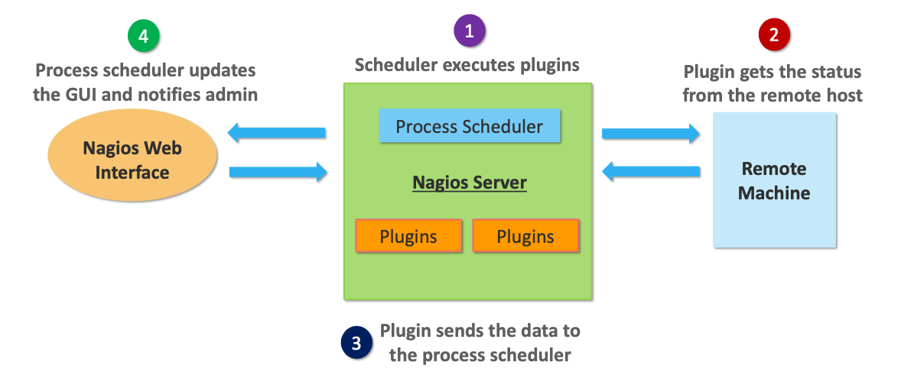


### Nagios Plugins

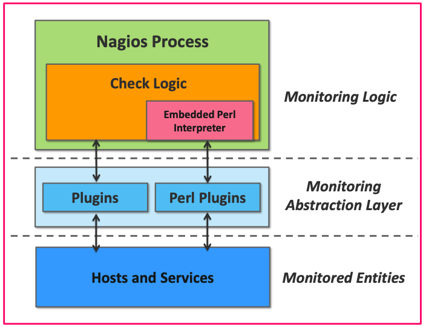

#### Plugins
- Plugins are scripts or compiled executable
- Nagios executes a plugin to check the status of a service or host
- Plugins also helps to monitor databases, operating systems, applications, network equipment, and protocols with Nagios

#### Embedded Perl Interpreter
- Nagios uses an embedded Perl interpreter to execute Perl plugins
- Without Perl interpreter, Nagios executes Perl and non-Perl plugins by forking and executing the plugins as an external command


#### Types of Nagios Plugins
- **Official Nagios Plugins**<br>50 official Nagios plugins are developed and maintained by the official Nagios Plugins Team
- **Community Plugins**<br>More than 3,000 third party Nagios plugins are developed by hundreds of Nagios community members
- **Custom Plugins**<br>You can write your own custom plugins by following some guidelines

<br>

### Nagios GUI
- Nagios interface is used to display the web pages generated by CGI
- It could be buttons to green or red, sound, graph, etc
- When alert is raised, the Nagios server sends a notification to the administrator
- 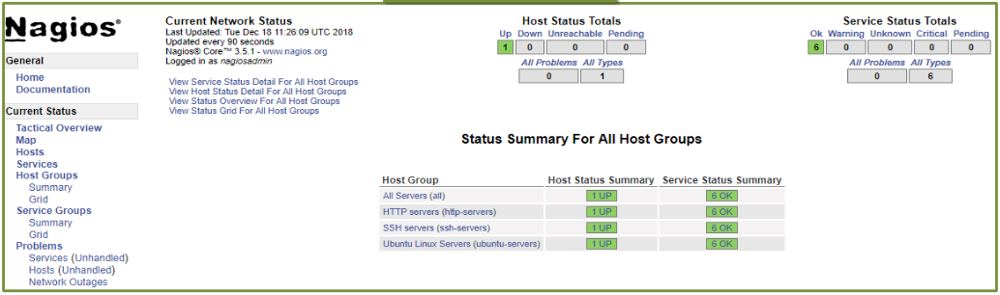

<br>
### Setting up and Configuring Nagios XI
#### Prerequisites for Setting up Nagios on Ubuntu
- Prior to Nagios installation, install packages such as Apache, PHP, and building packages on your Ubuntu system

#### Installation
1. **Run the following command for installing pre-required packages**
   
    ```sh
    sudo apt-get install wet build-essential apache2 php apache2-mod-php7.0 php-gd libgd-dev sendmail unzip
    ```

2. **Create Nagios user and group, then add them to Apache `www-data` graoup**

    ```sh
    sudo useradd nagios
    sudo groupadd nagcmd
    sudo usermod -a - G nagcmd nagios
    sudo usermod -G nagios, nagcmd www-data
    ```

3. **Download the latest Nagios package**

    ```sh
    wget https://assets.nagios.com/downloads/nagioscore/releases/nagios4.4.3.tar.gz
    ```

4. **Extract the tarball file**

    ```sh
    tar -xzf nagios-4.4.3.tar.gz
    cd nagios-4.4.3/
    ```

5. **Compile Nagios from source**

    ```sh
    ./configure --with-nagios-group=nagios --with-command-group=nagcmd
    ```

6. **Build Nagios files**

    ```sh
    make all
    ```

7. **Install all Nagios files**

    ```sh
    sudo make isntall
    ```

8. **Install init and external command configuration files**

    ```sh
    sudo make install-commandmode
    sudo make install-init
    sudo make install-config
    sudo /usr/bin/install -c -m 644 sample-config/httpd.conf/etc/apache2/sitesavailable/nagios.conf
    ```

9. **Copy event handler directly to the Nagios directory**
    ```sh
    sud cp -R contrib/eventhandlers//usr/local/nagios/libexec/
    sudo chow -R nagios:nagios/usr/local/nagios/libexec/eventhandlers
    ```

10. **Download latest Nagios package**

    ```sh
    wget https://nagios-plugins.org/download/nagiosplugins-2.2.1.tar.gz
    tar -xzf nagios-plugins*.tar.gz
    cd nagios-plugins-2.2.1/
    ```

11. **Install Nagios plugins**

    ```sh
    ./configure --with-nagios-user=nagios --with-nagios-group=nagios--with-openssl
    sudo make install
    ```

12. **Edit Nagios configuration file and uncomment line number 51 `cfg_dir=/usr/local/nagios/etc/servers`**

    ```sh
    cfg_dir=/usr/local/nagios/etc/servers
    sud gedit/usr/local/nagios/etc/nagios.cfg
    ```

13. **Create server directory**

    ```sh
    sudo mkdir -p /usr/local/nagios/etc/servers
    ```

14. **Edit contacts configuration file**

    ```sh
    sudo gedit /usr/local/nagios/etc/objects/contacts.cfg
    ```

15. **Enable Apache modules, and then configure `nagiosadmin` user**

    ```sh
    sudo a2enmod rewrite
    sudo a2enmod cgi
    sudo htpasswd -c /usr/local/nagios/etc/htpasswd.users nagiosadmin
    sudo ln -s /etc/apache2/sites-available/nagios.conf /etc/apache2/sites-enabled/
    ```

16. **Restart services**

    ```sh
    service apache2 restart
    service nagios start
    cd /etc/init.d/
    sudo cp /etc/init.d/skeleton /etc/init.d/Nagios
    ```

17. **Edit Nagios file**

    ```sh
    sud gedit/etc/init.d/Nagios
    DESC = "Nagios"
    NAME = nagios
    DAEMON = /usr/local/nagios/bin/NAME
    DAEMON_ARGS="-d /usr/local/nagios/etc/nagios.cfg"
    PIDFILE=/usr/local/nagios/var/$NAME.lock
    ``` 

18. **Make Nagios file executable and start Nagios**

    ```sh
    sudo chmod +x /etc/init.d/nagios
    service apache2 restan
    service nagios start
    ```

19. **Login to nagios**
  - In your browser, open URL http://localhost/nagios
  - Next, login with the username and password
  - 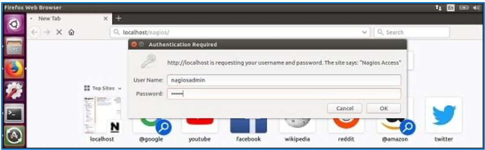 

<br>

## Managing Nagios XI

### Managing Permissions
- Managing users and their permissions is a critical task for Nagios administrators, particularly in multi-tenancy environments
- Permissions for any user can be configured or changed when:
  - Adding a new user account to Nagios XI
  - Editing an existing user on the Manage Users page

#### Managing Permissions step by step
1. Navigate to **Admin > Users > Managing Users**
2. To create a new user, click the `Add New User` button
3. When creating a user, enable the `Create as Monitoring Contact` option on the `Add New User` page. It ensures that a matching contact object is created in tha Nagios monitoring configuration <br> 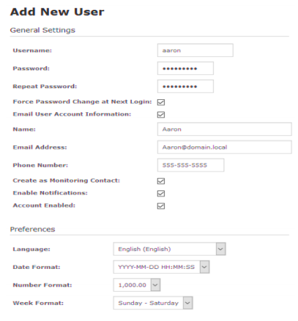
4. To edit existing user click the `Edit` icon for the user you want to edit<br> 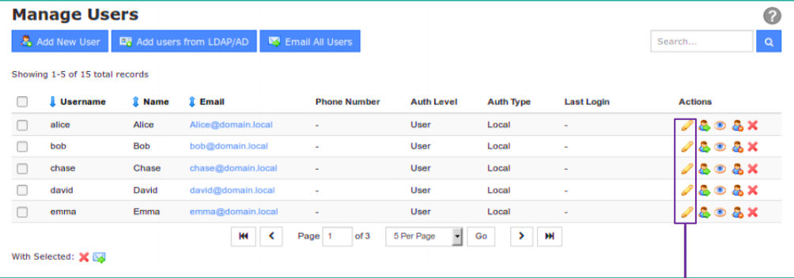

<br>

### Security Settings
- Options selected in the **Security Settings** section of the **Add/Edit** User page determine permissions
- **User** is the default selection under **Authorization Level** and this permission is the most restrictive permission in Nagios XI
- With no options selected, the user can only see hosts and services that are defined as a contact
- 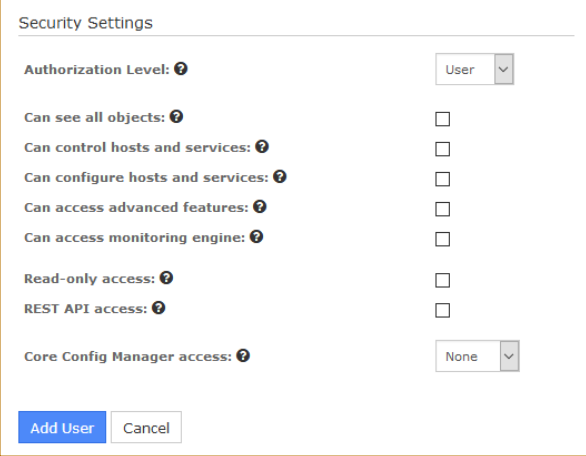

<br>

#### Description of Security Setting Option
|Security Setting Option|Option Description|
|---|---|
|*Can see all objects*| - User can see all monitored hosts and services|
|*Can control hosts and services*|User can: <br>- Acknowledge problems<br>- Schedule downtime<br>- Toggle notifications<br>- Force checks and all objects|
|*Can configure hosts and services*|User can:<br>- Run configuration Wizards<br>- Delete from details page<br>- Re-configure from detail page|
|*Can access advanced features*|User can:<br>- Edit check command in re-configure host/service page<br>- Show the Advanced tab and commands on host/service page<br>- Allows setting host parents in wizards and in re-configure<br>- host/service page|
|*Can access monitoring engine*|User can:<br>- See the monitoring process icon on the navigation bar<br>- Control (e.g. shutdown or restart) the monitoring engine<br>- Allow access to the Event Log|

#### Administrator Privileges
- Users configured as **Admin** under **Authorization Level** will have the ability to access, add and reconfigure the following:
  - Users
  - Hosts
  - Services
  - Components
  - Configuration Wizards
  - Dashlets
  - Program Settings
  - Security Credentials


<br><br>

## Nagios XI API
- Nagios XI API was added in XI 5
- It's a REST API in Nagios XI system with many features
- API permits users to read, write, delete, and update data in the Nagios XI system through authenticated commands via Nagios XI API keys
- Every user has their own API key to access the API<br>Access is defined as:
  - Normal users have READ access if the REST API Access setting is selected
  - Admin users will get full access to the API if the REST API Access setting is selected
  - Access to the documentation is limited to users who have API access 
- Common security settings for an advanced user<br> 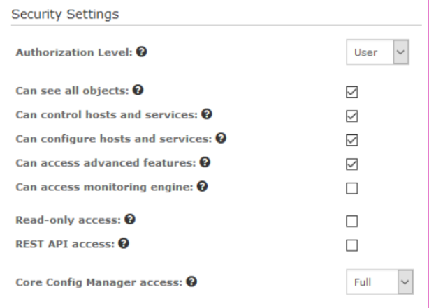
  
<br><br>

## Monitoring Using Nagios XI
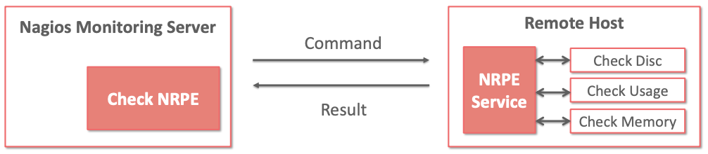

- Nagios daemon run checks on remote machines in NRPE (Nagios Remote Plugin Executor)
- Allows to run Nagios plugins on other machines remotely
- Monitors remote machine metrics like disk usage and CPU load
- Uses windows agent addons to check metrics of remote windows machines

## Installing and configuring NRPE
1. Install NRPE on the remote Linux machine to be monitored

    ```sh
    sudo apt-get isntall nagios-nrpe-server nagios-plugins
    ```
2. Create host file inside the server directly and place all the necessary definitions for the host

    ```sh
    sudo gedit /usr/local/nagios/etc/servers/ubuntu_host.cfg
    ```

    ```json
    # Ubuntu Host configuration file

    define host {
        use                 linux-server
        host_name           ubuntu_host
        alias               Ubuntu Host
        address             192.168.1.10
        register            1
    }

    define service {
        host_name           ubuntu_host
        service_description PING
        check_command       check_ping!100.0,20%!500.0,60%
        . . . .
    }
    ```

3. Verify configuration file

    ```sh
    sudo /usr/local/nagios/bin/nagios -v /usr/local/nagios/etc/nagios.cfg
    ```

4. If there are no errors, restart NRPE, Apache and Nagios

    ```sh
    service nagios-nrpe-server restart
    service apache2 restart
    service nagios restart
    ```

5. Open Nagios web interface and you can see the host which needs to be monitored has been added to Nagios core service<br>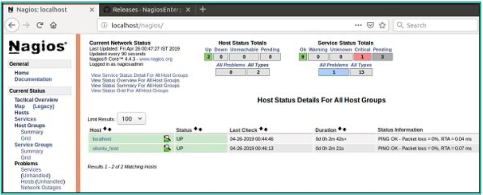

<br><br>

### Advanced Visualization
- Turns raw data into useful information
- To communicate complex ideas and information in an understandable format
- Wider audience of understanding
- Can present technical concepts to non-technical users
- Can clearly reveal the source of problems
- As environments get larger, data visualization becomes more important

<br><br>

## Nagios Products

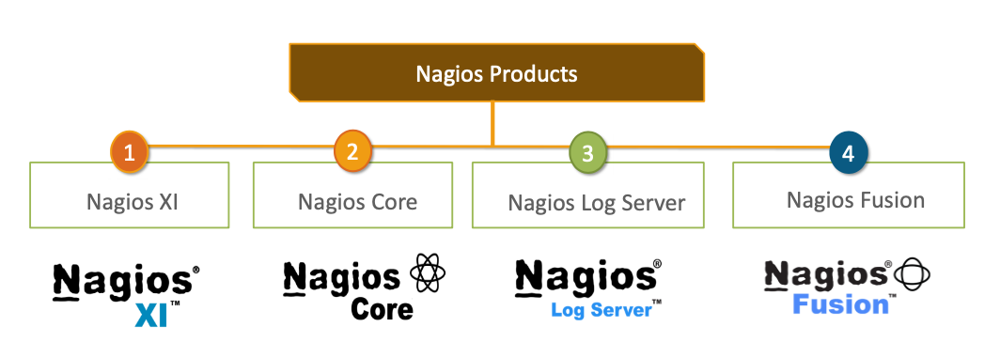

1. **Nagios XI**
    - Offers monitoring for complete IT infrastructure components like applications, services, network and operating systems
    - Nagios XI GUI is easily customizable
    - Price:
      - Standard edition costs $1995
      - Enterprise edition costs $3495
2. **Nagios Core**
    - Nagios core is absolutely free
    - Core on monitoring IT infrastructure
    - Nagios XI is fundamentally based on Nagios core
    - If there is a failure in the infrastructure, Nagios core sends and alert/notification to the administration
3. **Nagios Log Server**
    - Simplifies the searching of log data
    - Keeps all the log data at one location with high availability
    - Send alerts if any issues if found in the log data
    - It may scale to 1000s of servers to provide more power, speed, storage and reliability to your log analysis platform 
    - Price depends on the number of instances:
      - 1 instance $3995
      - 2 isntances $4995
      - 3 instances $5995
      - 4 isntances $6995
      - 10 instances $14995
4. **Nagios Fusion**
    - Provides a centralized view of complete monitoring system
    - With Nagios Fusion, you can setup separate monitoring servers for separate geofraphies
    - Esily integrated with Nagios XI and Nagios Core to give complete visibility of the infrastructure
    - Price $2495

<br>

### Capacity Planning
- Capacity Planning is a feature of the enterprise Edition License
- If you don't have the Enterprise Edition, you can enable free 60-day trial  to experience it's features before making a purchase
- Trial can be activated via **Admin > System Config > License Information**
- Capacity Planning is found under the Reports menu
- Default view displays one week capacity planning reports for the hosts in alphabetical order

<br>

### Audit Logging
- Collecting Logs using Nagios Log Server<br>Nagios Log Server for collecting logs from a variety of data sources includes the following:
  - Operating System logs from Windows and Linux machine
  - Syslog from different devices, applications and databases
  - Event Logs such as Windows Event Logs
  - Application-specific Logs such as IIS, Tomcat Apache and other enterprise applications
  - Database logs from industry-standard databases such as Oracle, MS SQL, MySQL, Postgre SQL, Maria DB, Big Data sources, etc.
  - Logs from any generic log source files
- Adutiting and Querying<br>With Nagios log server, you can meet following requirements on Audit and Compliance:
  - Generate audit reports from Logs
  - Identify how each application, database or operating system is being affected by user
  - User queries to create reports for specific audit requirements
  - Create dashboards that will help in auditing
  - Generate Database Audit reports, Application Aduit reports and Website Audit reports
- Complicance Requirements<br>Altnix can customize your Nagios Log Server to identify if you are complicant with following regulations
  - Compliance to ISO standards such as ISO9000 and ISO27000
  - Compliance to government regulations such as PCI, HIPAA and SOX
  - Meet requirements around management, maintenance and archival of Logs in an IT infrastructure
- Log Monitoring<br>Altnix can implement log monitoring using Nagios log server and other Nagios products:
  - File integrity monitoring
  - Monitoring unauthorized access to applications, systems and databases
  - Monitor for any regular expression in your logs
  - Create email alters based on Log Monitoring policies and send to an admin
- Altnix can integrate Nagios Log Server with Nagios XI and Nagios Core:
  - Create service checks in Nagios XI using pattern matches on Nagios Log Server
  - Generate alert and email notifications based on IT policy and Security Policy
  - Provide escalation as per business processes

#### Benefits of Audit Log Monitoring
- Increase Security
- Increase awareness of network infrastructure problems
- Increase availability of server, services and application
- Fastly detect the network outages and protocol failures
- Fastly detect failed processes, services, cron jobs and batch jobs
- Audit and regulatory complicane

<br><br>

## Log server 2.0 and alerting Nagios
#### Topics
- Log Server
- Log Server 2.0 Architecture
- Log Server 2.0 Interface
- Alerting on Data
- Setting up Alerting System
- Configuring Inputs, Outputs, and Filters
- Global Settings
- Auto Discovery
- Notifications

### Instroduction to Log Server
#### Nagios Log Server

An Application which provides organizations a central location to send their machine generated event data<br>Stores the data for later retrieval, querying and analysis in near real-time

- Greatly simplifies searching of log data
- Create alerts to notify you when potential threats arise
- Query your log data to quickly audit any system
- Get all of your log data in one location with high availability and failover buit-in
- Quickly configure your server and start monitoring your logs in minutes

### Features of Nagios Log server

**Infinite Scalability**
- Allows to quickly add extra cluster instances to your overall log analysis platform for providing more power, speed, storage and reliability
- Nagios Log Server is suitable for organization of any size and can be scaled up or down with push of a button

**Real Time Data**
- In just a few clicks, you can easily correlate log events across all servers
- Allows you to view log data from all of your servers in real time, as well as analyze and solve problems as they arise

**Adaptability**
- Nagios Log Server API is fully accessible, allows complete integration to fit the needs of your external applications
- Nagios Log Server easily integrates with third-party applications or your existing infrastructure

**User Management**
- Mlti-user capabilities allow IT teams to wirk together efficiently
- Admins can set access permissions, also can add, modify and remove users
- Admins grant specified users access to external API via access key

**Network Security**
- Nagios Log Server is a premier solution which is perfectly designed for security and network auditing
- Create alerts from the web-interface depending on your important queries and thresholds
- Notifies users via Nagios XI/Nagios Core, email, SNMP traps or executes a script to ensure quick problem resolution
- Keeps history archives of all events should a security audit be needed, and keeps your organization in compliance with security requirements

<br>

### Nagios Log Server - Use Case

**Most Common Use Case**
- An obvious application where Log Server is used as an advanced system to evaluate the received log events and send important items to Nagios Core or Nagios XI

**Least Common Use Cases**
- Developers can send debug logs to Log Server and simply filter out unimportant information, leaving only the most crucial information
- Organization can utilize the graphical and analytic capabilities of Log Server to analyze web server logs
- Users can achieve Nagios XI or Core check results using a small script and can set up custom dashboard for visulization of data
